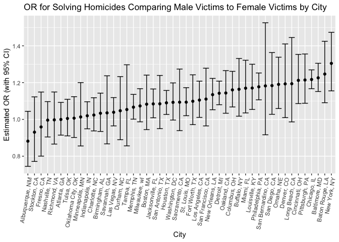

p8105 Hw#6
================
Kaylin De Silva
12-02-2024

``` r
library(tidyverse)
```

    ## ── Attaching core tidyverse packages ──────────────────────── tidyverse 2.0.0 ──
    ## ✔ dplyr     1.1.4     ✔ readr     2.1.5
    ## ✔ forcats   1.0.0     ✔ stringr   1.5.1
    ## ✔ ggplot2   3.5.1     ✔ tibble    3.2.1
    ## ✔ lubridate 1.9.3     ✔ tidyr     1.3.1
    ## ✔ purrr     1.0.2     
    ## ── Conflicts ────────────────────────────────────────── tidyverse_conflicts() ──
    ## ✖ dplyr::filter() masks stats::filter()
    ## ✖ dplyr::lag()    masks stats::lag()
    ## ℹ Use the conflicted package (<http://conflicted.r-lib.org/>) to force all conflicts to become errors

``` r
library(dplyr)
library(rvest)
```

    ## 
    ## Attaching package: 'rvest'
    ## 
    ## The following object is masked from 'package:readr':
    ## 
    ##     guess_encoding

``` r
set.seed(1)
```

This chunk loads the tidyverse, rvest, and dplyr libraries and fixes the
output.

**Problem 2**

``` r
#loading csv
raw_washington_df = read.csv(file = "./homicide-data.csv")

#viewing variables
head(raw_washington_df)
```

    ##          uid reported_date victim_last victim_first victim_race victim_age
    ## 1 Alb-000001      20100504      GARCIA         JUAN    Hispanic         78
    ## 2 Alb-000002      20100216     MONTOYA      CAMERON    Hispanic         17
    ## 3 Alb-000003      20100601 SATTERFIELD      VIVIANA       White         15
    ## 4 Alb-000004      20100101    MENDIOLA       CARLOS    Hispanic         32
    ## 5 Alb-000005      20100102        MULA       VIVIAN       White         72
    ## 6 Alb-000006      20100126        BOOK    GERALDINE       White         91
    ##   victim_sex        city state      lat       lon           disposition
    ## 1       Male Albuquerque    NM 35.09579 -106.5386 Closed without arrest
    ## 2       Male Albuquerque    NM 35.05681 -106.7153      Closed by arrest
    ## 3     Female Albuquerque    NM 35.08609 -106.6956 Closed without arrest
    ## 4       Male Albuquerque    NM 35.07849 -106.5561      Closed by arrest
    ## 5     Female Albuquerque    NM 35.13036 -106.5810 Closed without arrest
    ## 6     Female Albuquerque    NM 35.15111 -106.5378        Open/No arrest

The data set has 52,179 observations and 12 columns.

``` r
#creating a city_state variable
washington_df = raw_washington_df |>
  mutate(
    city_state = paste(city, state, sep=", "),
    solved = ifelse(disposition == "Closed by arrest", 1, 0)) |>
  filter(
    !(city_state %in% c("Dallas, TX", "Phoenix, AZ", "Kansas City, MO", "Tulsa, AL")
    ),
    victim_race %in% c("Black", "White")) |>
  mutate(
    victim_age = as.numeric(victim_age)) |>
  drop_na() |>
  mutate(
  victim_sex = fct_relevel(victim_sex, "Male"))
```

    ## Warning: There was 1 warning in `mutate()`.
    ## ℹ In argument: `victim_age = as.numeric(victim_age)`.
    ## Caused by warning:
    ## ! NAs introduced by coercion

``` r
fit_logistic = 
  washington_df |> 
  glm(solved ~ victim_sex + victim_race + victim_age, data = _, family = binomial()) 

fit_logistic |> 
  broom::tidy() |> 
  mutate(
    OR = exp(estimate),
    CI_upper = exp((estimate) + 1.96*(std.error)),
    CI_lower = exp((estimate) - 1.96*(std.error))) |>
  select(term, log_OR = estimate, OR, p.value, CI_upper, CI_lower) |> 
  knitr::kable(digits = 3)
```

| term              | log_OR |    OR | p.value | CI_upper | CI_lower |
|:------------------|-------:|------:|--------:|---------:|---------:|
| (Intercept)       | -0.150 | 0.861 |   0.000 |    0.904 |    0.820 |
| victim_sexFemale  |  0.507 | 1.661 |   0.000 |    1.760 |    1.567 |
| victim_sexUnknown |  0.429 | 1.536 |   0.174 |    2.851 |    0.827 |
| victim_raceWhite  |  0.607 | 1.834 |   0.000 |    1.944 |    1.731 |
| victim_age        | -0.002 | 0.998 |   0.004 |    0.999 |    0.996 |

The odds of a homicide being solved when the victim was a male was 1.661
(95% CI: 1.567, 1.760) times the odds of a homicide being solved when
the victim was a female, controlling for the victim’s age and race. The
beta estimate for this adjusted odds ratio is 0.507.

``` r
nest_glm_city_state =
  washington_df |> 
  nest(data = -city_state) |> 
  mutate(
    models = map(data, \(df) glm(solved ~ victim_sex + victim_race + victim_age, data = df)),
    results = map(models, broom::tidy)) |> 
  select(-data, -models) |> 
  unnest(results)

nest_glm_city_state |> 
  select(term, estimate, city_state, std.error, p.value) |>
  mutate(
    term = fct_inorder(term),
    OR = exp(estimate),
    CI_upper = exp((estimate) + 1.96*(std.error)),
    CI_lower = exp((estimate) - 1.96*(std.error))) |> 
  select(estimate, term, city_state, OR, CI_upper, CI_lower)|>
  filter(
    term == "victim_sexFemale"
  )|>
  pivot_wider(
    names_from = term, values_from = estimate)|>
  knitr::kable(digits = 3)
```

| city_state         |    OR | CI_upper | CI_lower | victim_sexFemale |
|:-------------------|------:|---------:|---------:|-----------------:|
| Albuquerque, NM    | 0.882 |    1.044 |    0.745 |           -0.126 |
| Atlanta, GA        | 0.999 |    1.092 |    0.914 |           -0.001 |
| Baltimore, MD      | 1.226 |    1.305 |    1.152 |            0.204 |
| Baton Rouge, LA    | 1.246 |    1.425 |    1.091 |            0.220 |
| Birmingham, AL     | 1.033 |    1.143 |    0.934 |            0.033 |
| Boston, MA         | 1.082 |    1.241 |    0.944 |            0.079 |
| Buffalo, NY        | 1.164 |    1.331 |    1.017 |            0.152 |
| Charlotte, NC      | 1.024 |    1.118 |    0.937 |            0.023 |
| Chicago, IL        | 1.217 |    1.269 |    1.167 |            0.196 |
| Cincinnati, OH     | 1.212 |    1.353 |    1.086 |            0.192 |
| Columbus, OH       | 1.160 |    1.261 |    1.067 |            0.149 |
| Denver, CO         | 1.193 |    1.410 |    1.009 |            0.177 |
| Detroit, MI        | 1.142 |    1.208 |    1.080 |            0.133 |
| Durham, NC         | 1.047 |    1.233 |    0.890 |            0.046 |
| Fort Worth, TX     | 1.099 |    1.242 |    0.972 |            0.094 |
| Fresno, CA         | 0.959 |    1.149 |    0.800 |           -0.042 |
| Houston, TX        | 1.090 |    1.157 |    1.027 |            0.086 |
| Indianapolis, IN   | 1.020 |    1.096 |    0.949 |            0.020 |
| Jacksonville, FL   | 1.084 |    1.165 |    1.009 |            0.081 |
| Las Vegas, NV      | 1.039 |    1.119 |    0.965 |            0.038 |
| Long Beach, CA     | 1.194 |    1.445 |    0.986 |            0.177 |
| Los Angeles, CA    | 1.105 |    1.208 |    1.011 |            0.100 |
| Louisville, KY     | 1.170 |    1.300 |    1.054 |            0.157 |
| Memphis, TN        | 1.066 |    1.136 |    1.001 |            0.064 |
| Miami, FL          | 1.170 |    1.322 |    1.035 |            0.157 |
| Milwaukee, wI      | 1.073 |    1.167 |    0.987 |            0.071 |
| Minneapolis, MN    | 1.013 |    1.200 |    0.856 |            0.013 |
| Nashville, TN      | 0.996 |    1.097 |    0.904 |           -0.004 |
| New Orleans, LA    | 1.134 |    1.223 |    1.052 |            0.126 |
| New York, NY       | 1.304 |    1.473 |    1.155 |            0.266 |
| Oakland, CA        | 1.143 |    1.265 |    1.033 |            0.134 |
| Oklahoma City, OK  | 1.006 |    1.123 |    0.902 |            0.006 |
| Omaha, NE          | 1.190 |    1.338 |    1.059 |            0.174 |
| Philadelphia, PA   | 1.177 |    1.252 |    1.106 |            0.163 |
| Pittsburgh, PA     | 1.214 |    1.356 |    1.088 |            0.194 |
| Richmond, VA       | 0.997 |    1.149 |    0.866 |           -0.003 |
| San Antonio, TX    | 1.085 |    1.239 |    0.950 |            0.081 |
| Sacramento, CA     | 1.093 |    1.274 |    0.939 |            0.089 |
| Savannah, GA       | 1.035 |    1.237 |    0.867 |            0.035 |
| San Bernardino, CA | 1.182 |    1.525 |    0.916 |            0.167 |
| San Diego, CA      | 1.184 |    1.363 |    1.028 |            0.169 |
| San Francisco, CA  | 1.110 |    1.278 |    0.965 |            0.105 |
| St. Louis, MO      | 1.094 |    1.172 |    1.020 |            0.089 |
| Stockton, CA       | 0.930 |    1.122 |    0.771 |           -0.072 |
| Tampa, FL          | 1.054 |    1.297 |    0.856 |            0.052 |
| Tulsa, OK          | 1.005 |    1.109 |    0.910 |            0.005 |
| Washington, DC     | 1.093 |    1.198 |    0.996 |            0.089 |

``` r
nest_glm_city_state |> 
  filter(
    term == "victim_sexFemale") |>
  mutate(city_state = fct_reorder(city_state, exp(estimate))) |>
  ggplot(aes(x = city_state, y = exp(estimate))) + 
  geom_point() + 
  geom_errorbar(aes(x=city_state, 
        ymin = exp((estimate) + 1.96*(std.error)), 
        ymax = exp((estimate) - 1.96*(std.error)))) +
  theme(axis.text.x = element_text(angle = 80, hjust = 1)) +
  labs(
    title = "OR for Solving Homicides Comparing Male Victims to Female Victims by City",
    x = "City",
    y = "Estimated OR (with 95% CI)"
  )
```

<!-- --> The
plot highlights the variety of confidence interval widths, with wider
intervals occurring at the lower and higher OR values. It also makes it
evident that around half of the ORs have confidence intervals that
include the null value of 1, indicating that though almost all estimates
are greater than 1, they are not all statistically significant.

**Problem 3**
